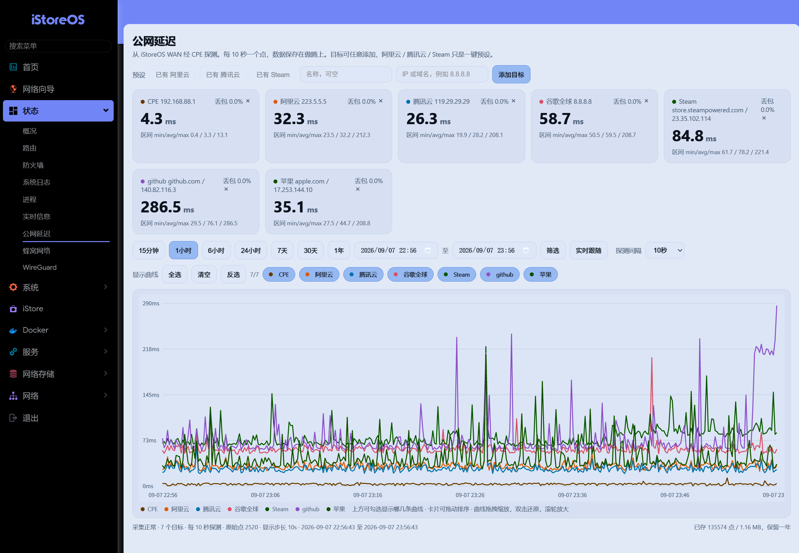
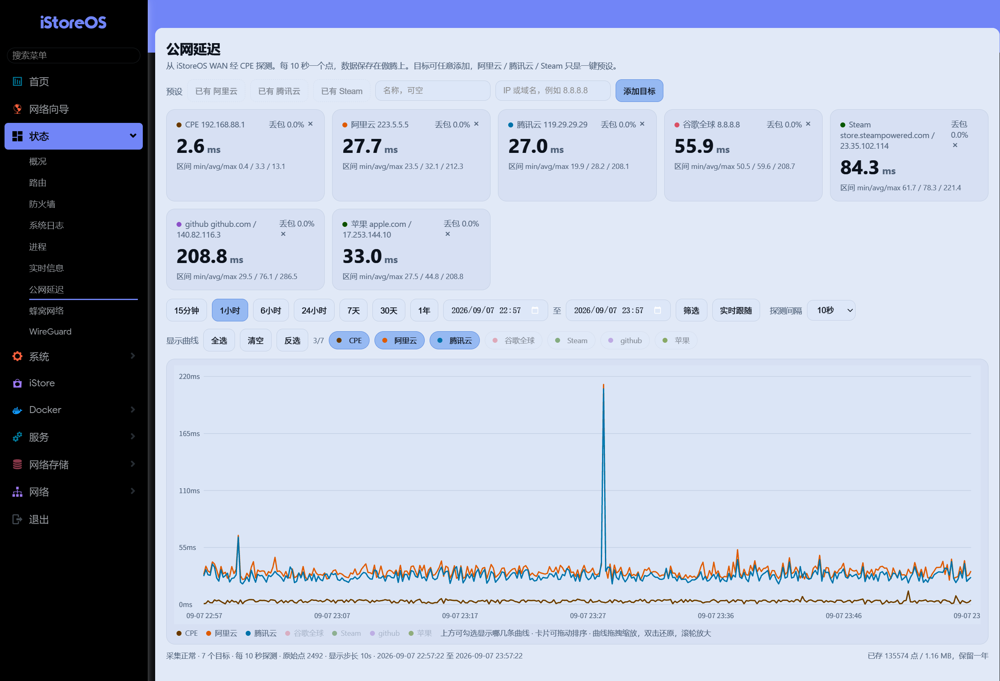

# luci-app-wan-latency

一个适用于 OpenWrt / iStoreOS 的公网延迟监控插件。它持续从 WAN 接口探测多个目标，将数据保存在路由器本地，并在 LuCI「状态 → 公网延迟」中展示实时状态和历史曲线。

## 功能

- 同时监控最多 12 个 IPv4 地址或域名
- ICMP 不可用时依次尝试 HTTPS、HTTP 和 DNS 探测
- 支持 2 秒至 5 分钟的采样间隔
- 支持 15 分钟至 1 年以及自定义时间范围
- 原始数据和 1 分钟汇总数据使用紧凑二进制格式保存
- 默认保留 366 天数据
- 自带阿里云、腾讯云和 Steam 三个预设目标

## 界面预览

### 实时状态与历史总览



### 曲线筛选



## 依赖

- `luci-base`
- `lua`
- `luci-lib-nixio`
- `cgi-io`
- `rpcd-mod-file`
- `curl`
- `ip-full`

## 已测试环境

| 系统 | 版本 | 内核 | 架构 | 状态 |
|---|---|---|---|---|
| iStoreOS | 24.10.8 (2026073111) | 6.6.144 | x86_64 | 已测试原始功能；鉴权改造待设备回归测试 |

其他 OpenWrt / iStoreOS 版本尚未验证，欢迎提交测试结果。

## 编译

将本目录复制到 OpenWrt SDK 或源码树的 `package/luci-app-wan-latency`：

```sh
make menuconfig
# LuCI -> Applications -> luci-app-wan-latency
make package/luci-app-wan-latency/compile V=s
```

生成的 `.ipk` 或 `.apk` 可在对应架构、对应 OpenWrt 版本的设备上安装。

## 数据与配置

- UCI 配置：`/etc/config/wan-latency`
- 目标列表：`/etc/wan-latency/targets.conf`
- 当前采样间隔：`/etc/wan-latency/interval`
- 历史数据：`/overlay/wan-latency/data/`
- 临时实时状态：`/tmp/wan-latency-latest.json`

历史数据、实时状态和设备上的自定义目标均未包含在本仓库中。

## 安全设计

浏览器不能直接调用监控后端。LuCI 页面通过带登录会话的 `cgi-io` RPC 桥接执行固定的 `/usr/libexec/wan-latency-api` 程序，rpcd ACL 将权限限定到该程序。直接打开静态页面不会获得数据访问能力。

后端只接受单个、长度不超过 8192 字节的 URL 编码参数，目标地址、目标 ID、采样间隔和查询时间范围均在后端验证。请勿将 LuCI 管理界面直接暴露到公网。

## 来源与许可

本仓库由一台正在运行的 iStoreOS 设备上的自用插件整理而成，以 [GPL-2.0-only](LICENSE) 许可证发布。
