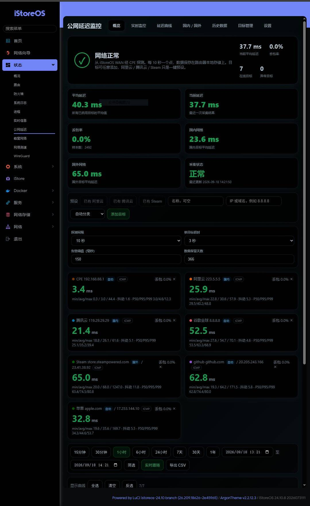
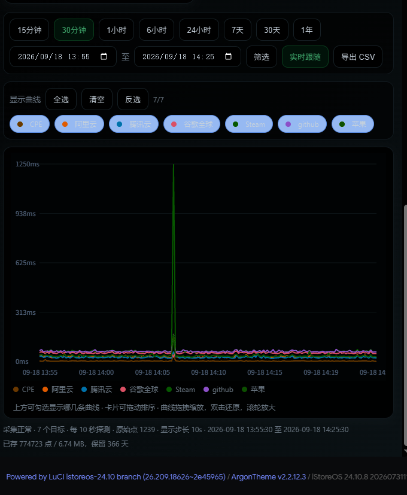

# luci-app-wan-latency — OpenWrt WAN 公网延迟监控插件

一个适用于 OpenWrt / ImmortalWrt / iStoreOS 的 LuCI 公网延迟监控插件。它持续从 WAN 接口探测多个目标，将数据保存在路由器本地，并在 LuCI「状态 → 公网延迟」中展示实时状态和历史曲线。

## v1.4.0

- 重做监控仪表盘，增加网络健康总览、平均/当前延迟、丢包、国内/国外分组、在线与异常目标统计。
- 目标支持国内/国外/自动分类；实时卡片展示探测方法、丢包、抖动、P50/P95/P99。
- 在页面内可调整探测间隔、单目标超时、告警阈值和历史保留天数，设置通过 LuCI 鉴权 API 写入 UCI。
- 增加 30 分钟历史范围；修复实时延迟显示为 `--` 和历史范围切换不更新的问题；实时数据独立于历史查询刷新。
- 已在 iStoreOS 24.10.8（Linux 6.6.144，x86_64）上完成实机界面与采集验证。

## 功能

- 同时监控最多 12 个 IPv4 地址或域名
- ICMP 不可用时依次尝试 HTTPS、HTTP 和 DNS 探测
- 支持 2 秒至 5 分钟的采样间隔
- 支持 15 分钟、30 分钟、1 小时、6 小时、24 小时、7 天、30 天、1 年及自定义时间范围
- 原始数据和 1 分钟汇总数据使用紧凑二进制格式保存
- 默认保留 366 天数据
- 自带阿里云、腾讯云和 Steam 三个预设目标
- 当前区间 CSV 导出及按目标筛选曲线

## 界面预览

### 实时状态与监控总览



### 历史曲线与时间范围



## 依赖

- `luci-base`
- `lua`
- `luci-lib-nixio`
- `cgi-io`
- `rpcd-mod-file`
- `curl`
- `ip-full`

## 已测试环境

| 系统 | 版本 | 内核 | 架构 | 状态 |
|---|---|---|---|---|
| iStoreOS | 24.10.8 (2026073111) | 6.6.144 | x86_64 | LuCI 界面、实时探测、历史曲线及时间范围 |

其他 OpenWrt / ImmortalWrt / iStoreOS 版本尚未验证，欢迎提交测试结果。

## 编译

将本目录复制到 OpenWrt SDK 或源码树的 `package/luci-app-wan-latency`：

```sh
make menuconfig
# LuCI -> Applications -> luci-app-wan-latency
make package/luci-app-wan-latency/compile V=s
```

生成的 `.ipk` 或 `.apk` 可在对应架构、对应 OpenWrt 版本的设备上安装。

## 安装发行版

请从 [Releases](https://github.com/xiaokeikei/luci-app-wan-latency/releases) 下载文件，并使用同一版本的 `SHA256SUMS` 校验完整性。

### iStoreOS / OpenWrt 24.10（推荐）

将 `.ipk` 上传到路由器后执行：

```sh
opkg install ./luci-app-wan-latency_1.4.0-1_all.ipk
```

### 自解压安装器

也可以使用 `.run` 安装同一个通用 IPK。它不会覆盖已有的 `/etc/config/wan-latency`、目标列表和历史数据：

```sh
chmod +x luci-app-wan-latency-1.4.0-1.run
./luci-app-wan-latency-1.4.0-1.run
```

`.run` 不会自动联网安装依赖；缺少依赖时会列出需要执行的 `opkg install` 命令。

OpenWrt 25.12 及以后使用 `.apk` 的系统尚未完成实机或官方 SDK 验证，因此当前 Release 不提供未经验证的 `.apk`。

## 数据与配置

- UCI 配置：`/etc/config/wan-latency`
- 目标列表：`/etc/wan-latency/targets.conf`
- 当前采样间隔：`/etc/wan-latency/interval`
- 历史数据：`/overlay/wan-latency/data/`
- 临时实时状态：`/tmp/wan-latency-latest.json`

历史数据、实时状态和设备上的自定义目标均未包含在本仓库中。

## 安全设计

浏览器不能直接调用监控后端。LuCI 页面通过带登录会话的 `cgi-io` RPC 桥接执行固定的 `/usr/libexec/wan-latency-api` 程序，rpcd ACL 将权限限定到该程序。直接打开静态页面不会获得数据访问能力。

后端只接受单个、长度不超过 8192 字节的 URL 编码参数，目标地址、目标 ID、采样间隔和查询时间范围均在后端验证。请勿将 LuCI 管理界面直接暴露到公网。

## 来源与许可

本仓库由一台正在运行的 iStoreOS 设备上的自用插件整理而成，以 [GPL-2.0-only](LICENSE) 许可证发布。
